## Overview
Influlance is a web application designed to connect marketers and
influencers, making it easier for marketers to collaborate with the right
influencers. At the same time, it provides influencers with opportunities
to find jobs that match their skills and interests.
My role in this project includes developing the frontend web and
conducting testing.

## Tech Stack
- Reactjs
- Antd
- redux/toolkit

## Preview

## Homepage
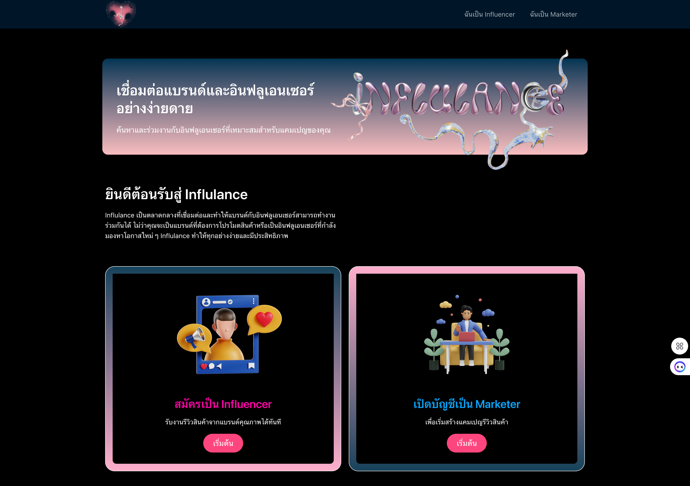

## Influencer
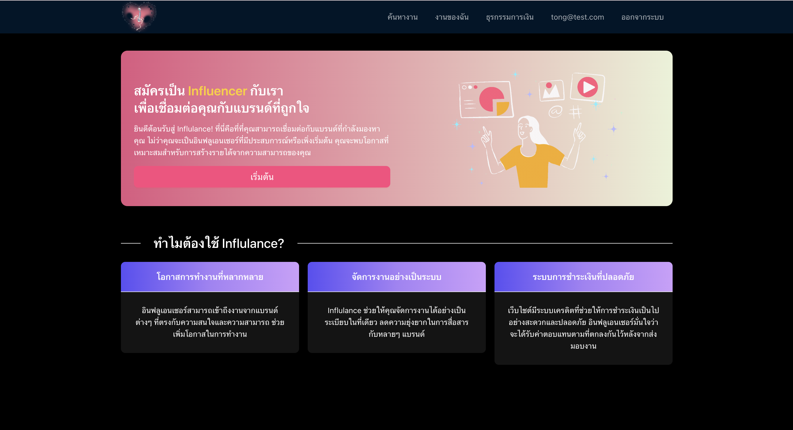
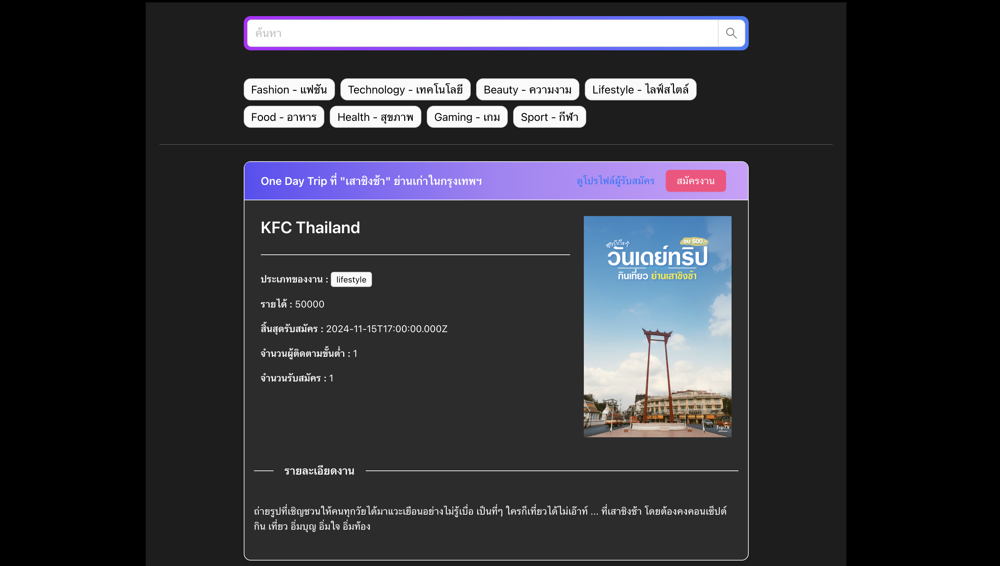
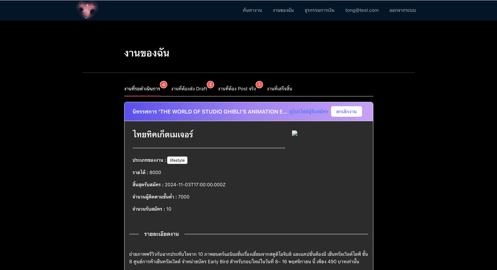
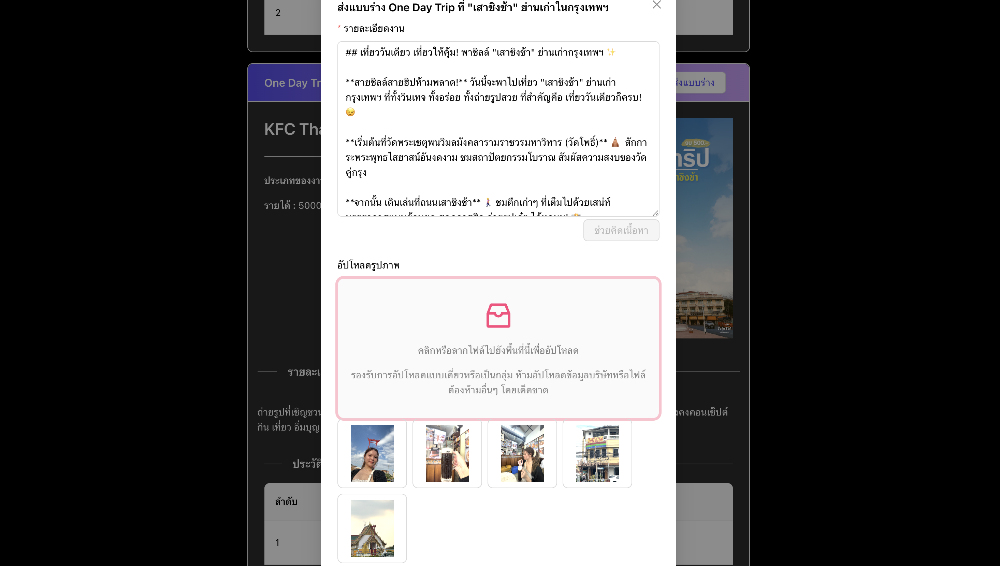
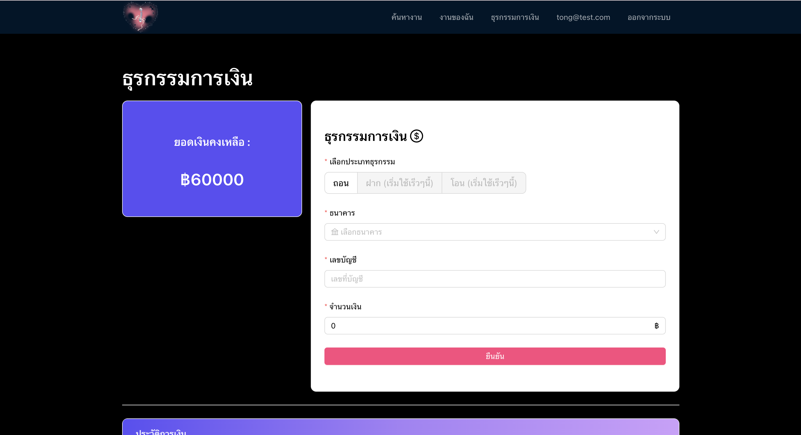
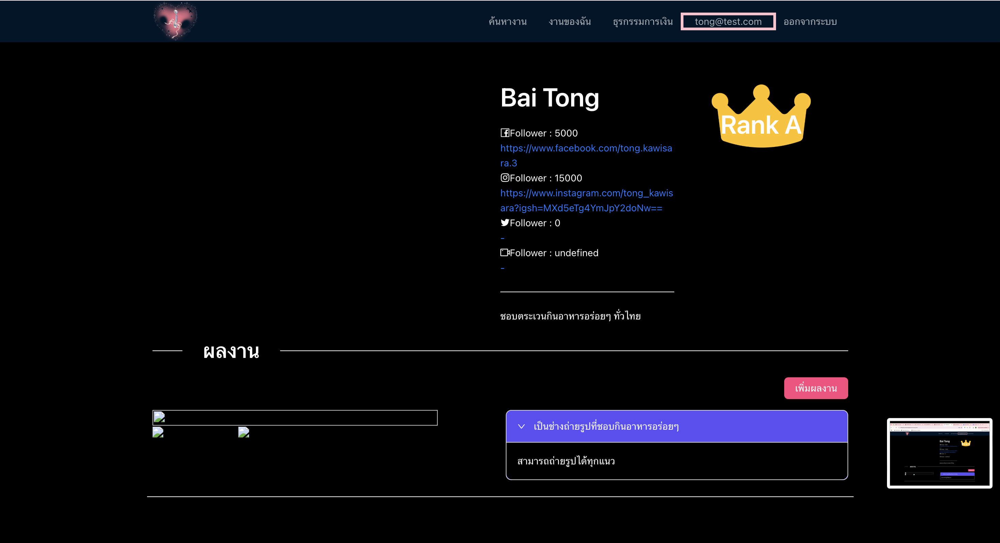

## Marketer
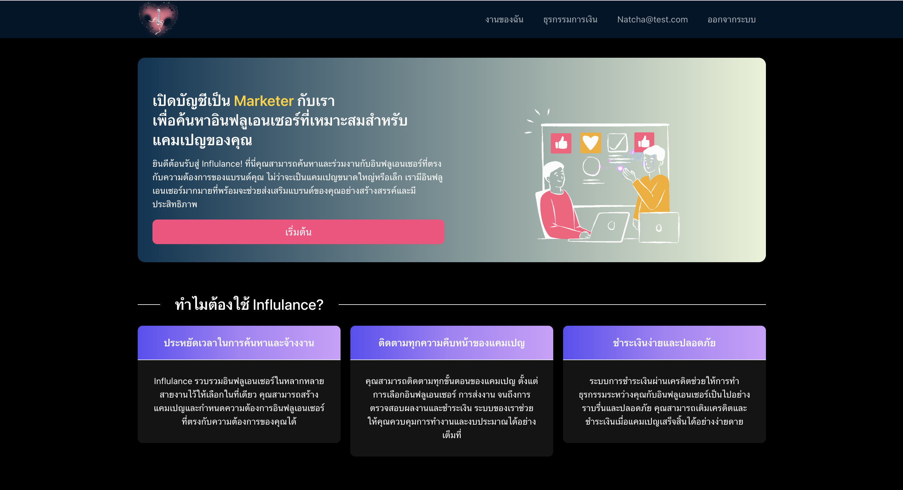
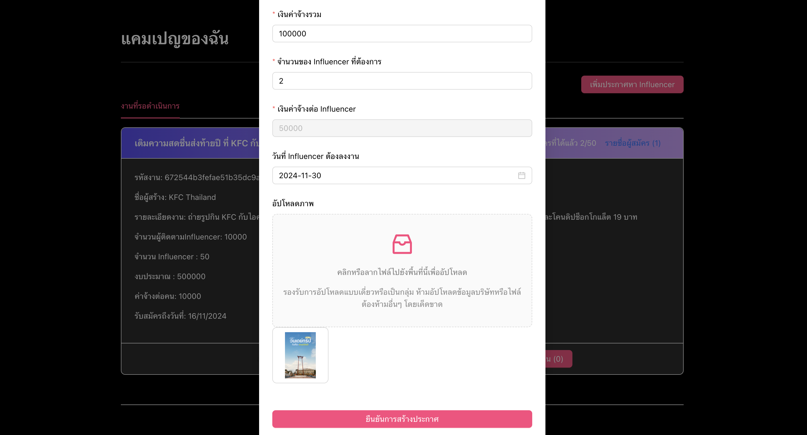
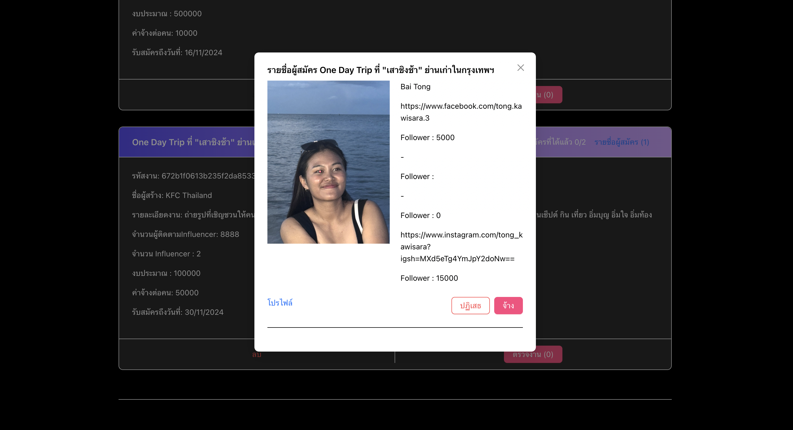
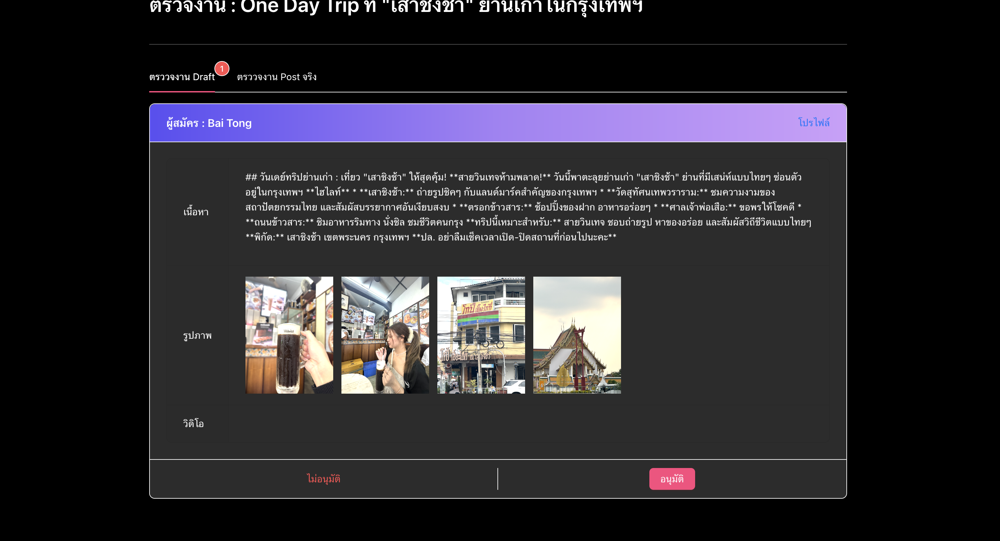
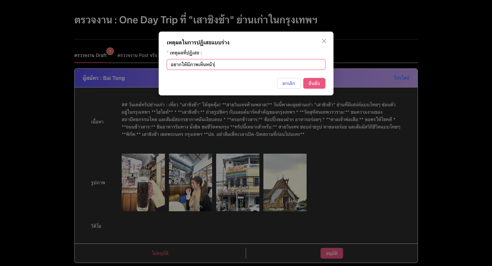
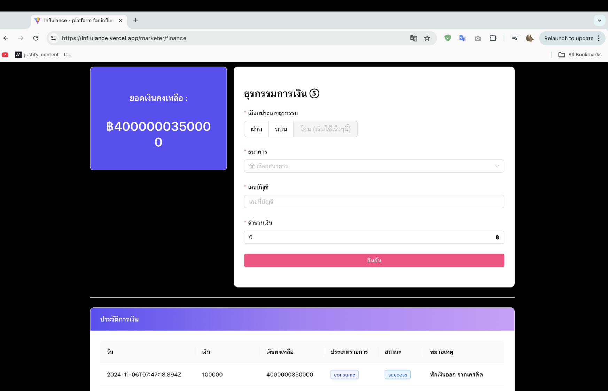